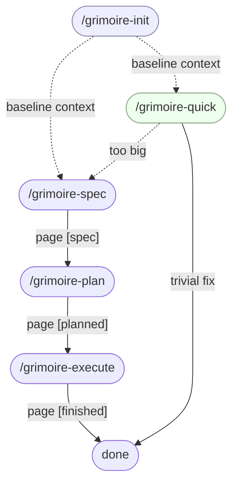
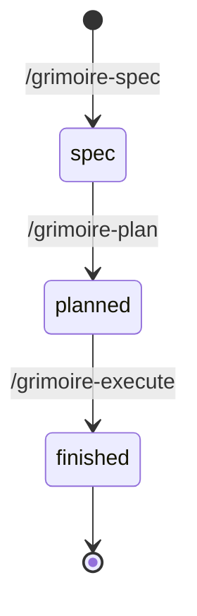

<div align="center">


# Grimoire

**English** · [Português (Brasil)](README.pt-BR.md)

A Claude Code plugin bundling eight skills for a disciplined **Spec → Plan → Execute** pipeline, with a **Quick** fast-path, an **Init** step that gives every session shared project context, and an **Update** step that keeps the plugin itself current.

</div>

> [!WARNING]
> **Early development.** Grimoire is brand-new — it works for the author's day-to-day Claude Code sessions but has not been battle-tested across many projects or teams. Expect rough edges, breaking changes between minor versions, and gaps in error messages. Issues and PRs are very welcome.

## Why Grimoire

Grimoire is a small bundle of Claude Code skills I built because I kept getting mediocre output from other context orchestrators — they were too heavy, too chatty, and too eager to take decisions away from me. The result was usually a project that drifted from what I actually wanted.

Grimoire is the opposite: a disciplined pipeline that asks until **you** are clear on what you want, then ships exactly that. It will help you think through a fuzzy idea, but it will not pretend to know your project better than you do, and it will not silently choose for you.

**It is not for non-technical users.** It assumes you can read code, evaluate a plan, and own the decisions it surfaces. If that's you, Grimoire stays out of your way and gets the page done.

> Every change Grimoire tracks is called a **page**: a folder under `.grimoire/pages/` containing a `SPEC.md` and one or more sequential step files, plus a single entry in `.grimoire/HISTORIC.md` that records its status (`[spec]` → `[planned]` → `[finished]`).

## Install

```
/plugin marketplace add ojCezarFerreira/grimoire
/plugin install grimoire@grimoire
```

That's it — `/grimoire-init`, `/grimoire-spec`, `/grimoire-plan`, `/grimoire-execute`, `/grimoire-quick`, `/grimoire-know`, `/grimoire-update`, and `/grimoire-note` are now available in every Claude Code session.

To pull a newer version later, just run `/grimoire-update` — it handles the version check, changelog diff, and the two official commands for you.

<details>
<summary>Other install options</summary>

```
# Install to project scope (shared via .claude/settings.json)
claude plugin install grimoire --scope project

# Local trial without a marketplace
claude --plugin-dir /path/to/this/repo
```

The `grimoire@grimoire` form in the main install command is `plugin-name@marketplace-name` (both happen to be `grimoire` here).

</details>

## Skills

| Skill | What it does | Details |
|-------|--------------|---------|
| `/grimoire-init` | Interview the project once and write `.grimoire/PROJECT.md` so every later skill starts with shared context. | [↓](#grimoire-init) |
| `/grimoire-spec <request>` | Clarify a feature/fix and write `SPEC.md` for a new page; registers it in `HISTORIC.md` as `[spec]`. | [↓](#grimoire-spec) |
| `/grimoire-plan <NNN>` | Decompose `SPEC.md` into sequential step files; flips the page to `[planned]`. | [↓](#grimoire-plan) |
| `/grimoire-execute <NNN>` | Run each step file in its own sub-agent under strict TDD; flips the page to `[finished]`. | [↓](#grimoire-execute) |
| `/grimoire-quick <fix>` | Fast-path for trivial fixes. Refuses and redirects to `/grimoire-spec` if scope is too big. | [↓](#grimoire-quick) |
| `/grimoire-know <question>` | Answer questions about the repository or its application — read-only, with web research and source citations when needed. | [↓](#grimoire-know) |
| `/grimoire-update` | Check installed vs. latest version, show changelog, guide you through the official update commands. | [↓](#grimoire-update) |
| `/grimoire-note <note>` | Surgically refine `.grimoire/PROJECT.md`'s Key Conventions and Notes from a free-text input — semantic dedup, retroactive consolidation, IDE-aware diff review. | [↓](#grimoire-note) |

## Skills in detail

### /grimoire-init

Run this once per project (and any time the project's purpose, stack, or constraints shift meaningfully). It scans your repo for signals — manifests, build configs, CI definitions, top-level layout — and then asks targeted questions about anything it cannot infer: the project's purpose, the audience, the current stage, non-obvious conventions.

After draft review and your approval, it writes `.grimoire/PROJECT.md` with sections for **Purpose**, **Audience**, **Tech Stack**, **Repository Layout**, **Key Conventions / Constraints**, **Current Status**, and **Notes**. From then on, every other Grimoire skill loads `PROJECT.md` automatically so the orchestrator and its sub-agents share baseline context.

Re-running enters **update mode** — it preserves what is still accurate and asks only about deltas. It never writes to `HISTORIC.md`; that is owned by `grimoire-spec`.

### /grimoire-spec

The only entry point of the long-form pipeline. You hand it a request in free text (`/grimoire-spec "add user-auth endpoint"`); it analyzes the relevant slice of the codebase, asks clarifying questions until consensus on **goals**, **non-goals**, **scope**, **acceptance criteria**, **constraints**, and **open questions**, and then — after draft review — writes `.grimoire/pages/NNN-[page-name]/SPEC.md`.

The page number `NNN` is auto-assigned as `max(existing) + 1`, zero-padded. The page name is short kebab-case (2–5 words) chosen to read meaningfully on its own.

`grimoire-spec` is the only skill that creates a new page folder and the only writer of `HISTORIC.md` beyond an in-place status flip — it bootstraps the file if missing, prepends the new entry as item `1` with status `[spec]`, and rotates the file to `.grimoire/bag/historic/HISTORIC-N.md` once it reaches five entries.

### /grimoire-plan

Takes a page number (`1` or `001`). Hard-stops with a clear message if the page does not exist, has no `SPEC.md`, or is not in `[spec]` status — it never silently fixes the state or runs another skill for you.

When preconditions pass, it reads `SPEC.md` in full, evaluates complexity, and writes sequential step files (`1-[step].md`, `2-[step].md`, …) inside the existing page folder. The plan owner decides how many step files to emit: simple pages get a single step file; larger pages get more to preserve context lucidity during execution. Finally, it updates the page's `HISTORIC.md` entry from `[spec]` to `[planned]` in place — no append, no rotate.

When the planned step breakdown contains genuinely independent steps, `grimoire-plan` MAY emit YAML frontmatter on step files (`depends-on`, `touches`) declaring inter-step dependencies — see [`GRIMOIRE-CONVENTIONS.md § Parallel execution`](GRIMOIRE-CONVENTIONS.md#-parallel-execution). The resulting wave plan is surfaced to you at the final-clarity-check pause-point before any step file is written, so you can veto a suspect parallelization. Pages whose steps are inherently sequential get no frontmatter and remain legacy strict-serial pages.

### /grimoire-execute

Takes a page number. Hard-stops if the page is missing, has no step files, or is not in `[planned]` status.

When preconditions pass, it spawns **one sub-agent per step file** in strict numeric order — step `N+1` never starts until step `N` has fully completed. Each sub-agent runs its step file under strict TDD (Red/Green/Refactor) and makes atomic Conventional Commits as it goes. On success, the page's `HISTORIC.md` entry is updated from `[planned]` to `[finished]` in place; no files are moved.

When any step file of the page declares `depends-on` frontmatter, `grimoire-execute` switches to a parallel-wave model: it computes Kahn-style topological waves, runs all steps in a wave concurrently — one sub-agent per step in its own throwaway git worktree under `.grimoire/bag/worktrees/page-NNN-step-K/` — cherry-picks successful siblings back to the main branch in step-number order, and tears down every worktree unconditionally before the next wave and at end of run. Pages with no `depends-on` frontmatter anywhere fall back to the legacy strict-serial path (byte-identical to pre-0.8.0). See [`GRIMOIRE-CONVENTIONS.md § Parallel execution`](GRIMOIRE-CONVENTIONS.md#-parallel-execution) for the full contract.

### /grimoire-quick

Fast-path for trivial fixes (typos, one-line bug fixes, small tweaks). Two pause points protect you from misuse:

- **Scope gatekeeper.** If `grimoire-quick` judges the request too large or risky, it STOPS and tells you to run `/grimoire-spec` instead. It will not "just try" a large change.
- **Plan authorization.** Even on small tasks, it prints an inline plan and waits for your explicit go-ahead before any code is written.

Quick stays fully ephemeral — no page folder, no `HISTORIC.md` entry, no rotation. The fix lands as one or more atomic Conventional Commits and that is it.

### /grimoire-know

Read-only Q&A about the repository or the application it builds. You ask a question in free text (`/grimoire-know "how does the historic rotation work?"`); it spawns a sub-agent with codebase access (`Read`, `Grep`, `Glob`, read-only `Bash`) and web access (`WebSearch`, `WebFetch`) that inspects only the files needed and consults the web when the answer depends on facts outside the repo.

The reply leads with the direct answer, explicitly flags anything the agent is not confident about, and ends with a `References` section listing every URL consulted when web research was used. Writes nothing, makes no commits, and never touches any `.grimoire/` state files — it is orthogonal to the Spec → Plan → Execute pipeline (same treatment as `grimoire-update`).

### /grimoire-update

Plugin self-maintenance. Reads the installed version from `${CLAUDE_PLUGIN_ROOT}/.claude-plugin/plugin.json`, fetches the latest `plugin.json` and `CHANGELOG.md` from GitHub, and — only if the versions differ — shows you the changelog diff between the two and asks for confirmation. On `yes`, it walks you through the two official Claude Code commands (`/plugin marketplace update grimoire`, then `/reload-plugins`) and waits for you to run each before continuing.

If you are already on the latest version, it exits silently. It writes nothing to your project and never spawns sub-agents — it is pure orchestration of two slash commands you run yourself.

### /grimoire-note

Surgical, incremental writer for `.grimoire/PROJECT.md`. You hand it a free-text note (`/grimoire-note "we always use snake_case in Postgres columns"`); it parses the input, semantically splits it into N distinct rules when applicable, reads `## Key Conventions / Constraints` and `## Notes` in full, and proposes the best synthesis against what is already there — merge, rewrite, generalize, or accept as new — favoring minimum-word phrasing. Every invocation also runs a retroactive consolidation pass over all existing rules in both sections, tightening near-duplicates and verbose phrasings.

Scope is deliberately tight. It never creates `PROJECT.md` (hard-stops and points you at `/grimoire-init` if it is missing), never adds or renames sections, never edits anything outside `## Key Conventions / Constraints` and `## Notes`, and never touches `HISTORIC.md` or any page folder. This is the dual-writer contract with `grimoire-init` — see [GRIMOIRE-CONVENTIONS.md § Project context](GRIMOIRE-CONVENTIONS.md#-project-context) for the full split.

The proposed `PROJECT.md` is presented for review via the IDE-aware pause-point: the file is written to disk so your editor renders the diff, and only after explicit approval does the skill make a single atomic commit (`docs(grimoire): refine project context`) touching only `.grimoire/PROJECT.md`. Orthogonal to the Spec → Plan → Execute pipeline (same family as `grimoire-know` and `grimoire-update`).

## How it works

The five pipeline skills (`init`, `spec`, `plan`, `execute`, `quick`) compose into a single flow. `init` runs once per project; `spec → plan → execute` is the long-form path for everything that deserves a page; `quick` is the escape hatch for trivial work that does not.



Every page in the long-form pipeline moves through three statuses recorded in `.grimoire/HISTORIC.md`. Skills hard-stop when invoked out of order — they never silently advance the state.



A finished page folder ends up looking like this:

```
.grimoire/pages/001-add-user-auth-endpoint/
├── SPEC.md          ← grimoire-spec
├── 1-schema.md      ← grimoire-plan
├── 2-endpoints.md   ← grimoire-plan
└── 3-tests.md       ← grimoire-plan
```

Page numbers passed to `/grimoire-plan` and `/grimoire-execute` accept either bare integers (`1`, `42`) or zero-padded form (`001`, `042`). If a skill is invoked out of order (plan before spec, execute before plan, or re-running a finished page), it hard-stops with a clear message naming the current state — it never silently fixes the state or runs another skill for you.

## Conventions

The pipeline skills (`init`, `spec`, `plan`, `execute`, `quick`) share a single source of truth for the workflow rules — strict TDD, atomic Conventional Commits, sub-agent orchestration, the `.grimoire/pages/` layout, project context loading, and the `HISTORIC.md` recency log and status-of-record — in [GRIMOIRE-CONVENTIONS.md](GRIMOIRE-CONVENTIONS.md). `grimoire-update` is plugin self-maintenance, `grimoire-know` is read-only Q&A, and `grimoire-note` is a surgical `PROJECT.md` writer, so none of them participate in those rules.

When a rule changes, it changes there once.

## Contributing

Grimoire is young and opinionated, but every issue, PR, and bug report is genuinely welcome — especially edge cases, awkward error messages, and "this skill didn't do what I expected" stories. Open an issue or a PR; there is no contribution too small.

For maintainer notes on editing the plugin itself, see [CLAUDE.md](CLAUDE.md).

## License

[MIT](LICENSE) © Cezar Ferreira.
