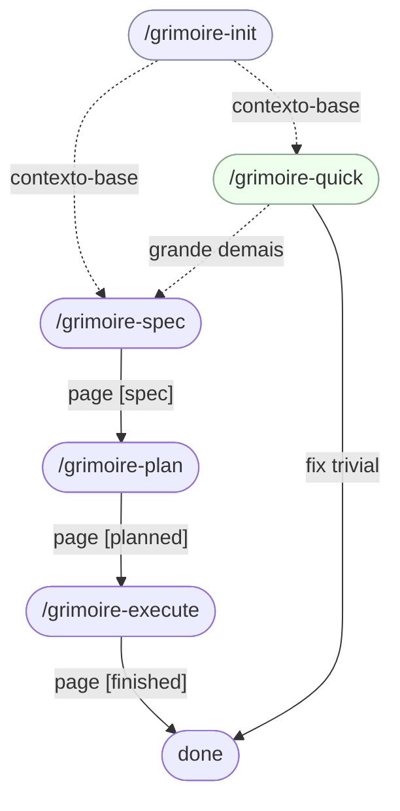
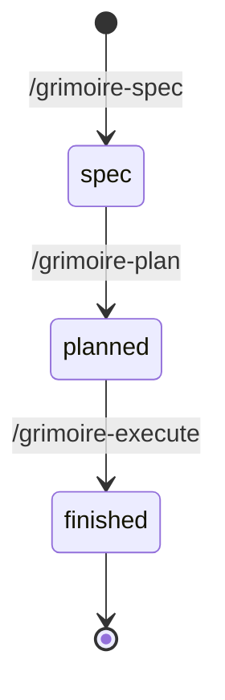

<div align="center">


# Grimoire

[English](README.md) · **Português (Brasil)**

Um plugin do Claude Code que reúne oito skills num pipeline disciplinado **Spec → Plan → Execute**, com um caminho rápido **Quick**, um passo **Init** que dá contexto de projeto compartilhado a toda sessão, e um passo **Update** que mantém o próprio plugin atualizado.

</div>

> [!WARNING]
> **Desenvolvimento inicial.** O Grimoire é novo — funciona bem nas sessões do dia a dia do autor no Claude Code, mas ainda não foi testado em muitos projetos ou equipes. Espere arestas, possíveis quebras de compatibilidade entre versões menores, e mensagens de erro pouco polidas. Issues e PRs são muito bem-vindos.

## Por que Grimoire

Grimoire é um aglomerado pequeno de skills do Claude Code que eu construí porque vinha tirando resultados medíocres de outros orquestradores de contexto — achei todos eles carregados demais, enrolados demais e ávidos demais por tomar decisões no meu lugar. O resultado costumava ser um projeto que ia drifteando para longe do que eu realmente queria.

Grimoire é o oposto: um pipeline disciplinado que pergunta até **você** ter clareza do que quer, e aí entrega exatamente isso. Ele ajuda você a pensar numa ideia ainda nebulosa, mas não vai fingir que entende do seu projeto melhor que você, e não vai escolher por você no escuro.

**Não é uma ferramenta para pessoas não-técnicas.** Ela assume que você sabe ler código, avaliar um plano e bancar as decisões que ela traz à tona. Se isso é você, o Grimoire sai do seu caminho e termina a page.

> Toda alteração rastreada pelo Grimoire é chamada de **page**: uma pasta sob `.grimoire/pages/` contendo um `SPEC.md` e um ou mais arquivos de step sequenciais, mais uma entrada única em `.grimoire/HISTORIC.md` que registra o status (`[spec]` → `[planned]` → `[finished]`).

## Instalação

```
/plugin marketplace add ojCezarFerreira/grimoire
/plugin install grimoire@grimoire
```

É isso — `/grimoire-init`, `/grimoire-spec`, `/grimoire-plan`, `/grimoire-execute`, `/grimoire-quick`, `/grimoire-know`, `/grimoire-update` e `/grimoire-note` ficam disponíveis em toda sessão do Claude Code.

Para atualizar mais tarde, é só rodar `/grimoire-update` — ele cuida da checagem de versão, do diff do changelog e dos dois comandos oficiais.

<details>
<summary>Outras opções de instalação</summary>

```
# Instalar no escopo do projeto (compartilhado via .claude/settings.json)
claude plugin install grimoire --scope project

# Teste local sem marketplace
claude --plugin-dir /caminho/para/este/repo
```

O formato `grimoire@grimoire` no comando principal é `nome-do-plugin@nome-do-marketplace` (por acaso os dois são `grimoire` aqui).

</details>

## Skills

| Skill                     | O que faz                                                                                                                   | Detalhes               |
| ------------------------- | --------------------------------------------------------------------------------------------------------------------------- | ---------------------- |
| `/grimoire-init`          | Entrevista o projeto uma vez e escreve `.grimoire/PROJECT.md` para que cada skill seguinte parta de contexto compartilhado. | [↓](#grimoire-init)    |
| `/grimoire-spec <pedido>` | Esclarece uma feature/fix e escreve `SPEC.md` para uma nova page; registra a page em `HISTORIC.md` como `[spec]`.           | [↓](#grimoire-spec)    |
| `/grimoire-plan <NNN>`    | Decompõe `SPEC.md` em arquivos de step sequenciais; muda a page para `[planned]`.                                           | [↓](#grimoire-plan)    |
| `/grimoire-execute <NNN>` | Executa cada step file num sub-agente próprio sob TDD estrito; muda a page para `[finished]`.                               | [↓](#grimoire-execute) |
| `/grimoire-quick <fix>`   | Caminho rápido para fixes triviais. Recusa e redireciona para `/grimoire-spec` se o escopo for grande demais.               | [↓](#grimoire-quick)   |
| `/grimoire-know <pergunta>` | Responde perguntas sobre o repositório ou a aplicação — somente leitura, com pesquisa na web e citação de fontes quando necessário. | [↓](#grimoire-know)    |
| `/grimoire-update`        | Compara versão instalada vs. mais recente, mostra o changelog, e te guia pelos comandos oficiais de update.                 | [↓](#grimoire-update)  |
| `/grimoire-note <nota>`   | Refina cirurgicamente `Key Conventions` e `Notes` em `.grimoire/PROJECT.md` a partir de texto livre — dedup semântica, consolidação retroativa, revisão de diff IDE-aware. | [↓](#grimoire-note)    |

## Skills em detalhe

### /grimoire-init

Rode uma vez por projeto (e sempre que o propósito, a stack ou as restrições do projeto mudarem de verdade). Ele escaneia o repositório por sinais — manifests, configs de build, definições de CI, layout de primeiro nível — e então faz perguntas direcionadas sobre o que não conseguiu inferir: propósito, audiência, estágio atual, convenções não-óbvias.

Após revisão do rascunho e sua aprovação, ele escreve `.grimoire/PROJECT.md` com seções para **Purpose**, **Audience**, **Tech Stack**, **Repository Layout**, **Key Conventions / Constraints**, **Current Status** e **Notes**. A partir daí, toda skill do Grimoire carrega `PROJECT.md` automaticamente para que o orquestrador e os sub-agentes compartilhem contexto-base.

Re-rodar entra em **modo update** — preserva o que ainda está correto e pergunta só sobre o que mudou. Ele nunca escreve em `HISTORIC.md`; isso é responsabilidade do `grimoire-spec`.

### /grimoire-spec

O único ponto de entrada do pipeline longo. Você passa um pedido em texto livre (`/grimoire-spec "adicionar endpoint de user-auth"`); ele analisa o pedaço relevante do código, faz perguntas até haver consenso sobre **goals**, **non-goals**, **scope**, **acceptance criteria**, **constraints** e **open questions**, e então — após revisão do rascunho — escreve `.grimoire/pages/NNN-[page-name]/SPEC.md`.

O número `NNN` é atribuído automaticamente como `max(existentes) + 1`, com zero-padding. O nome da page é um kebab-case curto (2–5 palavras) escolhido para fazer sentido sozinho.

`grimoire-spec` é a única skill que cria uma nova pasta de page e a única que escreve em `HISTORIC.md` além de uma virada de status in-place — ele faz o bootstrap do arquivo se não existir, prependa a nova entrada como item `1` com status `[spec]`, e rotaciona o arquivo para `.grimoire/bag/historic/HISTORIC-N.md` quando chega a cinco entradas.

### /grimoire-plan

Recebe um número de page (`1` ou `001`). Faz hard-stop com mensagem clara se a page não existir, não tiver `SPEC.md`, ou não estiver com status `[spec]` — ele nunca arruma o estado silenciosamente nem roda outra skill por você.

Quando as precondições passam, ele lê o `SPEC.md` inteiro, avalia a complexidade e escreve arquivos de step sequenciais (`1-[step].md`, `2-[step].md`, …) dentro da pasta de page existente. O dono do plano decide quantos arquivos emitir: pages simples ganham um único step file; pages maiores ganham mais, para preservar a lucidez do contexto durante a execução. No fim, ele atualiza a entrada da page no `HISTORIC.md` de `[spec]` para `[planned]` in-place — sem append, sem rotate.

### /grimoire-execute

Recebe um número de page. Hard-stop se a page não existir, não tiver step files, ou não estiver com status `[planned]`.

Quando as precondições passam, ele spawna **um sub-agente por step file** em ordem numérica estrita — o step `N+1` nunca começa antes do step `N` ter terminado por completo. Cada sub-agente executa seu step file sob TDD estrito (Red/Green/Refactor) e faz commits atômicos no padrão Conventional Commits conforme avança. No sucesso, a entrada da page no `HISTORIC.md` vira de `[planned]` para `[finished]` in-place; nenhum arquivo é movido.

### /grimoire-quick

Caminho rápido para fixes triviais (typos, bug fixes de uma linha, ajustes pequenos). Dois pontos de pausa te protegem do mau uso:

- **Scope gatekeeper.** Se o `grimoire-quick` julgar o pedido grande ou arriscado demais, ele PARA e te manda rodar `/grimoire-spec`. Ele não vai "só tentar" uma mudança grande.
- **Autorização do plano.** Mesmo em tarefas pequenas, ele imprime um plano inline e espera seu aval explícito antes de escrever qualquer linha de código.

Quick é totalmente efêmero — sem pasta de page, sem entrada em `HISTORIC.md`, sem rotação. O fix entra como um ou mais commits atômicos no padrão Conventional Commits e pronto.

### /grimoire-know

Q&A somente-leitura sobre o repositório ou a aplicação que ele constrói. Você passa uma pergunta em texto livre (`/grimoire-know "como funciona a rotação do historic?"`); ele spawna um sub-agente com acesso ao código (`Read`, `Grep`, `Glob`, `Bash` somente-leitura) e à web (`WebSearch`, `WebFetch`) que inspeciona só os arquivos necessários e consulta a web quando a resposta depende de fatos fora do repositório.

A resposta começa com a resposta direta, marca explicitamente o que o agente não está confiante, e termina com uma seção `References` listando cada URL consultada quando houve pesquisa web. Não escreve nada, não faz commits, e nunca toca em nenhum arquivo de estado do `.grimoire/` — é ortogonal ao pipeline Spec → Plan → Execute (mesmo tratamento do `grimoire-update`).

### /grimoire-update

Manutenção do próprio plugin. Lê a versão instalada de `${CLAUDE_PLUGIN_ROOT}/.claude-plugin/plugin.json`, busca o `plugin.json` e o `CHANGELOG.md` mais recentes no GitHub, e — somente se as versões diferirem — te mostra o diff de changelog entre as duas e pede confirmação. No `yes`, ele te guia pelos dois comandos oficiais do Claude Code (`/plugin marketplace update grimoire`, e depois `/reload-plugins`) e espera você rodar cada um antes de continuar.

Se você já está na versão mais recente, ele sai em silêncio. Não escreve nada no seu projeto e nunca spawna sub-agentes — é pura orquestração de dois comandos slash que você mesmo executa.

### /grimoire-note

Writer cirúrgico e incremental do `.grimoire/PROJECT.md`. Você passa uma nota em texto livre (`/grimoire-note "sempre usamos snake_case em colunas Postgres"`); ele parseia a entrada, divide-a semanticamente em N regras distintas quando aplicável, lê `## Key Conventions / Constraints` e `## Notes` por completo, e propõe a melhor síntese contra o que já está lá — merge, reescrita, generalização ou aceitação como nova entrada — favorecendo frases com o mínimo de palavras. Cada invocação também roda um passe de consolidação retroativa sobre todas as regras existentes nas duas seções, apertando quase-duplicatas e frases verbosas.

O escopo é deliberadamente apertado. Ele nunca cria `PROJECT.md` (faz hard-stop e te aponta para `/grimoire-init` se o arquivo estiver faltando), nunca adiciona nem renomeia seções, nunca edita nada fora de `## Key Conventions / Constraints` e `## Notes`, e nunca toca em `HISTORIC.md` nem em pasta de page. Esse é o contrato de dual-writer com `grimoire-init` — veja [GRIMOIRE-CONVENTIONS.md § Project context](GRIMOIRE-CONVENTIONS.md#-project-context) para a divisão completa.

O `PROJECT.md` proposto é apresentado para revisão via pause-point IDE-aware: o arquivo é escrito em disco para o editor renderizar o diff, e só depois de aprovação explícita a skill faz um único commit atômico (`docs(grimoire): refine project context`) tocando apenas `.grimoire/PROJECT.md`. Ortogonal ao pipeline Spec → Plan → Execute (mesma família de `grimoire-know` e `grimoire-update`).

## Como funciona

As cinco skills do pipeline (`init`, `spec`, `plan`, `execute`, `quick`) compõem um fluxo único. `init` roda uma vez por projeto; `spec → plan → execute` é o caminho longo para tudo que merece uma page; `quick` é a saída de emergência para trabalho trivial que não merece.



Cada page no pipeline longo passa por três status registrados em `.grimoire/HISTORIC.md`. As skills fazem hard-stop quando invocadas fora de ordem — nunca avançam o estado em silêncio.



Uma pasta de page finalizada termina assim:

```
.grimoire/pages/001-add-user-auth-endpoint/
├── SPEC.md          ← grimoire-spec
├── 1-schema.md      ← grimoire-plan
├── 2-endpoints.md   ← grimoire-plan
└── 3-tests.md       ← grimoire-plan
```

Os números de page passados para `/grimoire-plan` e `/grimoire-execute` aceitam inteiros simples (`1`, `42`) ou em forma zero-padded (`001`, `042`). Se uma skill é invocada fora de ordem (plan antes de spec, execute antes de plan, ou re-rodando uma page finalizada), ela faz hard-stop com uma mensagem clara nomeando o estado atual — nunca arruma o estado em silêncio nem roda outra skill por você.

## Convenções

As skills do pipeline (`init`, `spec`, `plan`, `execute`, `quick`) compartilham uma única fonte de verdade para as regras de workflow — TDD estrito, Conventional Commits atômicos, orquestração de sub-agentes, layout `.grimoire/pages/`, carregamento de contexto de projeto, e o log de recência e status-of-record em `HISTORIC.md` — em [GRIMOIRE-CONVENTIONS.md](GRIMOIRE-CONVENTIONS.md). O `grimoire-update` é manutenção do próprio plugin, o `grimoire-know` é Q&A somente-leitura, e o `grimoire-note` é um writer cirúrgico do `PROJECT.md`, então nenhum dos três participa dessas regras.

Quando uma regra muda, ela muda lá uma vez.

## Contribuindo

O Grimoire é jovem e opinativo, mas toda issue, PR e relato de bug é genuinamente bem-vindo — em especial casos de borda, mensagens de erro estranhas, e histórias de "essa skill não fez o que eu esperava". Abra uma issue ou um PR; nenhuma contribuição é pequena demais.

Notas para mantenedores que querem editar o próprio plugin estão em [CLAUDE.md](CLAUDE.md).

## Licença

[MIT](LICENSE) © Cezar Ferreira.
